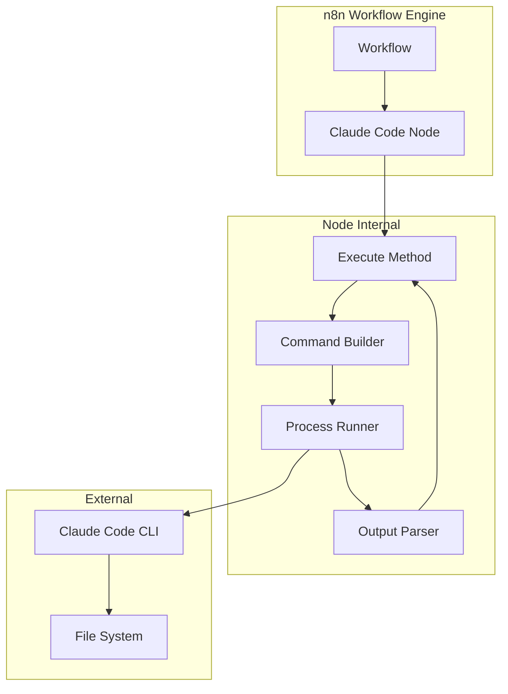
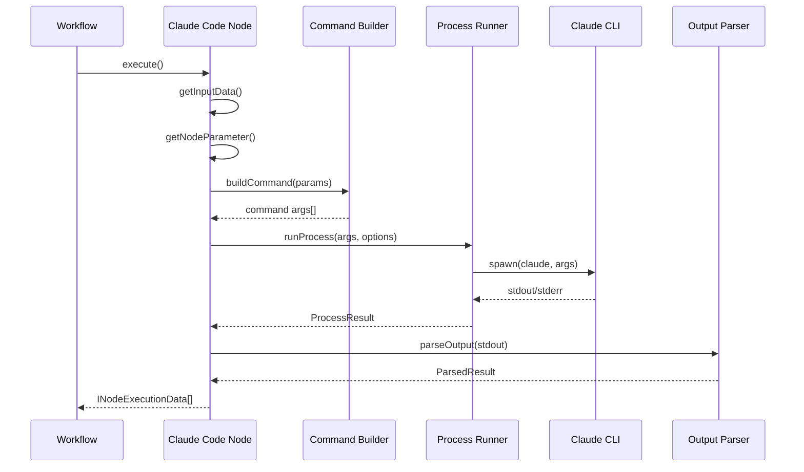
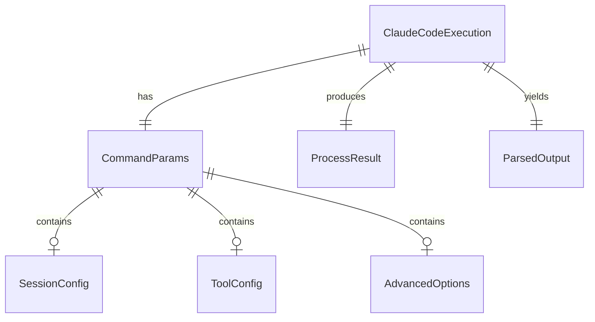

# Design Document

## Overview

**Purpose**: このn8n-nodes-claudecodeは、n8nワークフロー自動化プラットフォームにおいてローカルにインストールされたClaude Code CLI（`claude`コマンド）を実行する機能を提供し、AIエージェント機能をワークフローに統合します。

**Users**: n8nユーザー（自動化エンジニア、開発者、DevOpsエンジニア）がAIによるコード生成、分析、タスク実行をワークフローに組み込むために利用します。

**Impact**: n8nの機能を拡張し、Claude Code CLIの全機能をワークフローから利用可能にします。

### Goals
- Claude Code CLIの全オプションをn8nノードパラメータとして公開
- JSON出力の自動パースと構造化データへの変換
- セッション管理によるマルチターン会話のサポート
- 適切なエラーハンドリングとタイムアウト制御

### Non-Goals
- Anthropic APIへの直接接続（CLIを経由）
- n8n Cloud環境でのサポート（ローカル環境専用）
- Claude Code CLI自体の自動インストール

## Architecture

### Architecture Pattern & Boundary Map



**Architecture Integration**:
- **Selected pattern**: 命令的（Imperative）スタイル — execute()メソッドでプロセス実行を完全制御
- **Domain boundaries**: ノード定義（UI/パラメータ）、コマンドビルダー（CLI引数構築）、プロセス実行（spawn）、出力パーサー（JSON解析）
- **Existing patterns preserved**: Example.node.tsの実装パターン、NodeOperationErrorエラーハンドリング
- **New components rationale**: コマンドビルダーとプロセスランナーを分離して単一責任を維持
- **Steering compliance**: 該当なし（ステアリングディレクトリ未設定）

### Technology Stack

| Layer | Choice / Version | Role in Feature | Notes |
|-------|------------------|-----------------|-------|
| Runtime | Node.js (n8n依存) | プロセス実行環境 | child_process.spawn使用 |
| Framework | n8n-workflow | ノードインターフェース提供 | INodeType, IExecuteFunctions |
| Language | TypeScript 5.9 | 型安全な実装 | 既存テンプレート準拠 |
| Build Tool | @n8n/node-cli | ビルド・リント | package.json設定済み |
| External | Claude Code CLI | AI実行エンジン | ユーザー環境に依存 |

### File Structure

```
nodes/ClaudeCode/
├── ClaudeCode.node.ts      # メインノード定義（INodeType実装）
├── ClaudeCode.node.json    # n8nコデックスメタデータ
├── utils/
│   ├── commandBuilder.ts   # CLI引数構築ロジック
│   ├── processRunner.ts    # child_process.spawn実行
│   └── outputParser.ts     # JSON出力パース
└── types.ts                # 共有型定義

credentials/
└── ClaudeCodeApi.credentials.ts  # （将来用：API認証が必要な場合）

icons/
└── claude.svg              # ノードアイコン
```

## System Flows

### 基本実行フロー



**Key Decisions**:
- spawnを使用してstdout/stderrを分離キャプチャ
- JSON出力失敗時は生テキストをフォールバック
- タイムアウトはユーザー設定可能（デフォルト300秒）

## Requirements Traceability

| Requirement | Summary | Components | Interfaces | Flows |
|-------------|---------|------------|------------|-------|
| 1.1-1.6 | CLI実行基盤 | ProcessRunner | ProcessRunnerService | 基本実行フロー |
| 2.1-2.4 | プロンプト入力 | ClaudeCodeNode | properties定義 | - |
| 3.1-3.4 | システムプロンプト | CommandBuilder | buildCommand() | - |
| 4.1-4.4 | モデル選択 | CommandBuilder | buildCommand() | - |
| 5.1-5.5 | ツール制御 | CommandBuilder | buildCommand() | - |
| 6.1-6.6 | セッション管理 | CommandBuilder | buildCommand() | - |
| 7.1-7.4 | 作業ディレクトリ | ProcessRunner | ProcessOptions | - |
| 8.1-8.4 | エージェント制御 | CommandBuilder | buildCommand() | - |
| 9.1-9.3 | MCP設定 | CommandBuilder | buildCommand() | - |
| 10.1-10.6 | 出力パース | OutputParser | OutputParserService | 基本実行フロー |
| 11.1-11.5 | エラーハンドリング | ProcessRunner, Node | エラー型定義 | - |
| 12.1-12.6 | n8n統合/UX | ClaudeCodeNode | INodeTypeDescription | - |
| 13.1-13.6 | 高度なオプション | CommandBuilder | buildCommand() | - |

## Components and Interfaces

| Component | Domain/Layer | Intent | Req Coverage | Key Dependencies | Contracts |
|-----------|--------------|--------|--------------|------------------|-----------|
| ClaudeCodeNode | Node | メインノード定義 | 12.1-12.6, 2.1-2.4 | n8n-workflow (P0) | Service |
| CommandBuilder | Logic | CLI引数構築 | 3-9, 13 | - | Service |
| ProcessRunner | Infrastructure | プロセス実行 | 1.1-1.6, 7.1-7.4, 11.1-11.5 | child_process (P0) | Service |
| OutputParser | Logic | 出力解析 | 10.1-10.6 | - | Service |

### Node Layer

#### ClaudeCodeNode

| Field | Detail |
|-------|--------|
| Intent | n8nノードのメイン定義、UIパラメータとexecute()メソッドを提供 |
| Requirements | 2.1-2.4, 12.1-12.6 |

**Responsibilities & Constraints**
- INodeTypeインターフェースの実装
- ノードメタデータ（displayName, icon, properties等）の定義
- execute()メソッドで入力処理→コマンド構築→実行→出力変換のオーケストレーション

**Dependencies**
- Inbound: n8n-workflow — INodeType, IExecuteFunctions (P0)
- Outbound: CommandBuilder — コマンド引数構築 (P0)
- Outbound: ProcessRunner — プロセス実行 (P0)
- Outbound: OutputParser — 出力パース (P0)

**Contracts**: Service [x]

##### Service Interface

```typescript
interface INodeTypeDescription {
  displayName: string;           // 'Claude Code'
  name: string;                  // 'claudeCode'
  icon: Icon;                    // Claude/Anthropicアイコン
  group: string[];               // ['transform']
  version: number;               // 1
  description: string;           // ノード説明
  defaults: { name: string };
  inputs: NodeConnectionType[];  // [NodeConnectionTypes.Main]
  outputs: NodeConnectionType[]; // [NodeConnectionTypes.Main]
  usableAsTool: boolean;         // true
  properties: INodeProperties[]; // パラメータ定義
}

// execute()メソッドシグネチャ
async execute(this: IExecuteFunctions): Promise<INodeExecutionData[][]>;
```

##### Node Properties Structure

```typescript
// パラメータグループ構成
const properties: INodeProperties[] = [
  // === 基本設定 ===
  {
    displayName: 'Prompt',
    name: 'prompt',
    type: 'string',
    typeOptions: { rows: 4 },
    default: '',
    required: true,
    description: 'Claude Codeに送信するプロンプト',
  },
  {
    displayName: 'Working Directory',
    name: 'workingDirectory',
    type: 'string',
    default: '',
    description: 'Claude Codeの作業ディレクトリ（空の場合はn8nの作業ディレクトリ）',
  },

  // === モデル設定 ===
  {
    displayName: 'Model',
    name: 'model',
    type: 'options',
    options: [
      { name: 'Default', value: '' },
      { name: 'Sonnet', value: 'sonnet' },
      { name: 'Opus', value: 'opus' },
      { name: 'Haiku', value: 'haiku' },
      { name: 'Custom', value: 'custom' },
    ],
    default: '',
    description: '使用するClaudeモデル',
  },
  {
    displayName: 'Custom Model',
    name: 'customModel',
    type: 'string',
    default: '',
    displayOptions: { show: { model: ['custom'] } },
    description: 'カスタムモデル名（例: claude-sonnet-4-20250514）',
  },

  // === システムプロンプト ===
  {
    displayName: 'System Prompt Mode',
    name: 'systemPromptMode',
    type: 'options',
    options: [
      { name: 'None', value: 'none' },
      { name: 'Append', value: 'append' },
      { name: 'Replace', value: 'replace' },
    ],
    default: 'none',
    description: 'システムプロンプトの設定モード',
  },
  {
    displayName: 'System Prompt',
    name: 'systemPrompt',
    type: 'string',
    typeOptions: { rows: 4 },
    default: '',
    displayOptions: { show: { systemPromptMode: ['append', 'replace'] } },
    description: 'システムプロンプトの内容',
  },

  // === セッション設定 ===
  {
    displayName: 'Session Mode',
    name: 'sessionMode',
    type: 'options',
    options: [
      { name: 'New Session', value: 'new' },
      { name: 'Continue Last', value: 'continue' },
      { name: 'Resume Specific', value: 'resume' },
    ],
    default: 'new',
    description: 'セッション管理モード',
  },
  {
    displayName: 'Session ID',
    name: 'sessionId',
    type: 'string',
    default: '',
    displayOptions: { show: { sessionMode: ['resume'] } },
    description: '再開するセッションのID',
  },
  {
    displayName: 'Fork Session',
    name: 'forkSession',
    type: 'boolean',
    default: false,
    displayOptions: { show: { sessionMode: ['resume'] } },
    description: 'セッションをフォークして新しいIDを生成',
  },

  // === ツール設定 ===
  {
    displayName: 'Tool Control',
    name: 'toolControl',
    type: 'options',
    options: [
      { name: 'Default', value: 'default' },
      { name: 'Preset', value: 'preset' },
      { name: 'Custom', value: 'custom' },
      { name: 'Allow List', value: 'allow' },
      { name: 'Deny List', value: 'deny' },
      { name: 'None', value: 'none' },
    ],
    default: 'default',
    description: 'ツール使用の制御方法',
  },
  {
    displayName: 'Tool Preset',
    name: 'toolPreset',
    type: 'options',
    options: [
      { name: 'Read Only', value: 'Read,Glob,Grep' },
      { name: 'Code Review', value: 'Read,Glob,Grep,WebSearch,WebFetch' },
      { name: 'Code Edit', value: 'Read,Edit,Write,Glob,Grep' },
      { name: 'Full Development', value: 'Read,Edit,Write,Bash,Glob,Grep' },
      { name: 'All Tools', value: 'default' },
    ],
    default: 'Read,Glob,Grep',
    displayOptions: { show: { toolControl: ['preset'] } },
    description: 'よく使うツールの組み合わせ',
  },
  {
    displayName: 'Tools',
    name: 'tools',
    type: 'string',
    default: 'Read,Edit,Bash',
    displayOptions: { show: { toolControl: ['custom'] } },
    description: '使用可能なツール（カンマ区切り）',
  },
  {
    displayName: 'Allowed Tools',
    name: 'allowedTools',
    type: 'string',
    default: '',
    displayOptions: { show: { toolControl: ['allow'] } },
    description: '許可するツールパターン（カンマ区切り）',
  },
  {
    displayName: 'Disallowed Tools',
    name: 'disallowedTools',
    type: 'string',
    default: '',
    displayOptions: { show: { toolControl: ['deny'] } },
    description: '禁止するツールパターン（カンマ区切り）',
  },

  // === エージェント制御 ===
  {
    displayName: 'Max Turns',
    name: 'maxTurns',
    type: 'number',
    default: 0,
    description: 'エージェントの最大ターン数（0=無制限）',
  },
  {
    displayName: 'Custom Agents',
    name: 'customAgents',
    type: 'json',
    default: '',
    description: 'カスタムサブエージェント定義（JSON）',
  },

  // === MCP設定 ===
  {
    displayName: 'MCP Config Path',
    name: 'mcpConfigPath',
    type: 'string',
    default: '',
    description: 'MCP設定ファイルのパス',
  },
  {
    displayName: 'Permission Mode',
    name: 'permissionMode',
    type: 'options',
    options: [
      { name: 'Default', value: '' },
      { name: 'Plan', value: 'plan' },
    ],
    default: '',
    description: 'パーミッションモード',
  },

  // === 高度な設定 ===
  {
    displayName: 'Additional Options',
    name: 'additionalOptions',
    type: 'collection',
    placeholder: 'Add Option',
    default: {},
    options: [
      {
        displayName: 'Timeout (seconds)',
        name: 'timeout',
        type: 'number',
        default: 300,
        description: '実行タイムアウト（秒）',
      },
      {
        displayName: 'Verbose',
        name: 'verbose',
        type: 'boolean',
        default: false,
        description: '詳細ログを有効にする',
      },
      {
        displayName: 'Debug',
        name: 'debug',
        type: 'string',
        default: '',
        description: 'デバッグフィルタ（例: api,mcp）',
      },
      {
        displayName: 'Fallback Model',
        name: 'fallbackModel',
        type: 'string',
        default: '',
        description: 'フォールバックモデル',
      },
      {
        displayName: 'JSON Schema',
        name: 'jsonSchema',
        type: 'json',
        default: '',
        description: '出力JSONスキーマ',
      },
      {
        displayName: 'Betas',
        name: 'betas',
        type: 'string',
        default: '',
        description: '有効にするベータ機能（カンマ区切り）',
      },
      {
        displayName: 'Additional Directories',
        name: 'additionalDirs',
        type: 'string',
        default: '',
        description: '追加の作業ディレクトリ（カンマ区切り）',
      },
      {
        displayName: 'Skip Permissions',
        name: 'skipPermissions',
        type: 'boolean',
        default: false,
        description: '⚠️ パーミッションチェックをスキップ（危険）',
      },
      {
        displayName: 'Extra CLI Flags',
        name: 'extraFlags',
        type: 'string',
        default: '',
        description: '追加のCLIフラグ（上級者向け）',
      },
    ],
  },
];
```

### Logic Layer

#### CommandBuilder

| Field | Detail |
|-------|--------|
| Intent | ノードパラメータからCLI引数配列を構築 |
| Requirements | 3.1-3.4, 4.1-4.4, 5.1-5.5, 6.1-6.6, 8.1-8.4, 9.1-9.3, 13.1-13.6 |

**Responsibilities & Constraints**
- パラメータをCLIフラグに変換
- 相互排他的オプションの検証
- 引数のエスケープ処理

**Dependencies**
- Inbound: ClaudeCodeNode — パラメータ値 (P0)

**Contracts**: Service [x]

##### Service Interface

```typescript
interface CommandBuilderParams {
  prompt: string;
  model?: string;
  customModel?: string;
  systemPromptMode: 'none' | 'append' | 'replace';
  systemPrompt?: string;
  sessionMode: 'new' | 'continue' | 'resume';
  sessionId?: string;
  forkSession?: boolean;
  toolControl: 'default' | 'restrict' | 'allow' | 'deny' | 'none';
  tools?: string;
  allowedTools?: string;
  disallowedTools?: string;
  maxTurns?: number;
  customAgents?: string;
  mcpConfigPath?: string;
  permissionMode?: string;
  additionalOptions?: {
    timeout?: number;
    verbose?: boolean;
    debug?: string;
    fallbackModel?: string;
    jsonSchema?: string;
    betas?: string;
    additionalDirs?: string;
    skipPermissions?: boolean;
    extraFlags?: string;
  };
}

interface CommandBuilderResult {
  args: string[];
  errors: string[];
}

function buildCommand(params: CommandBuilderParams): CommandBuilderResult;
```

- Preconditions: promptは空でないこと
- Postconditions: 有効なCLI引数配列を返す、エラーがある場合はerrorsに追加
- Invariants: `-p`と`--output-format json`は常に含まれる

### Infrastructure Layer

#### ProcessRunner

| Field | Detail |
|-------|--------|
| Intent | child_process.spawnでClaude CLIを実行し結果を返す |
| Requirements | 1.1-1.6, 7.1-7.4, 11.1-11.5 |

**Responsibilities & Constraints**
- プロセスのスポーンと監視
- stdout/stderrのキャプチャ
- タイムアウト処理
- 終了コードの検証

**Dependencies**
- Inbound: ClaudeCodeNode — コマンド引数、オプション (P0)
- External: Node.js child_process — spawn (P0)

**Contracts**: Service [x]

##### Service Interface

```typescript
interface ProcessOptions {
  cwd?: string;
  timeout?: number;  // milliseconds
  env?: Record<string, string>;
}

interface ProcessResult {
  stdout: string;
  stderr: string;
  exitCode: number;
  timedOut: boolean;
}

/**
 * Claude CLIプロセスを実行する
 * @throws NodeOperationError - CLI_NOT_FOUND: claudeコマンドが見つからない場合
 * @throws NodeOperationError - TIMEOUT: タイムアウトした場合（partialOutputを含む）
 * @throws NodeOperationError - EXECUTION_ERROR: 終了コードが0以外の場合
 */
async function runProcess(
  node: INode,
  args: string[],
  options: ProcessOptions
): Promise<ProcessResult>;
```

- Preconditions: argsは有効な配列
- Postconditions: 成功時はProcessResultを返す、失敗時はNodeOperationErrorをスロー
- Invariants: タイムアウト時は必ずプロセスをkillしてからエラーをスロー
- Error Handling: n8nの`continueOnFail()`パターンと連携

#### OutputParser

| Field | Detail |
|-------|--------|
| Intent | CLI出力をパースして構造化データに変換 |
| Requirements | 10.1-10.6 |

**Responsibilities & Constraints**
- JSON出力のパース
- 主要フィールドの抽出
- パース失敗時のフォールバック処理

**Dependencies**
- Inbound: ClaudeCodeNode — stdout文字列 (P0)

**Contracts**: Service [x]

##### Service Interface

```typescript
interface ParsedOutput {
  result: string;              // メインレスポンステキスト
  sessionId?: string;          // セッションID
  messages?: unknown[];        // メッセージ履歴
  usage?: {
    inputTokens?: number;
    outputTokens?: number;
  };
  raw: unknown;                // パース前の生データ
  parseError?: string;         // パースエラー時のメッセージ（フォールバック用）
}

/**
 * CLI出力をパースして構造化データに変換する
 * パース失敗時も例外をスローせず、rawOutputとparseErrorを含むオブジェクトを返す（フォールバック）
 */
function parseOutput(stdout: string): ParsedOutput;
```

- Preconditions: stdoutは文字列
- Postconditions: 常にParsedOutputを返す（パース失敗時はフォールバック）
- Invariants: rawフィールドは常に元データを保持
- Fallback: JSONパース失敗時は`result`に生テキスト、`parseError`にエラーメッセージを設定

## Data Models

### Domain Model



**Entities**:
- `ClaudeCodeExecution`: 1回のノード実行を表すルートエンティティ
- `CommandParams`: CLI引数を構成するパラメータ集合
- `ProcessResult`: プロセス実行の結果
- `ParsedOutput`: パース後の構造化出力

### Logical Data Model

**n8n Output Structure**:
```typescript
interface INodeExecutionData {
  json: {
    result: string;
    sessionId?: string;
    usage?: {
      inputTokens?: number;
      outputTokens?: number;
    };
    exitCode: number;
    raw: unknown;
    error?: string;
  };
  pairedItem?: number;
}
```

## Error Handling

### Error Strategy

| Error Type | Detection | Response | User Message |
|------------|-----------|----------|--------------|
| CLI_NOT_FOUND | spawn ENOENT | NodeOperationError | "Claude Code CLIが見つかりません。インストールを確認してください。" |
| TIMEOUT | timeout event | NodeOperationError + partial | "実行がタイムアウトしました（{timeout}秒）" |
| EXECUTION_ERROR | exitCode != 0 | NodeOperationError | "CLI実行エラー: {stderr}" |
| PARSE_ERROR | JSON.parse失敗 | Warning + fallback | "出力のパースに失敗しました。生出力を返します。" |
| VALIDATION_ERROR | パラメータ検証 | NodeOperationError | "パラメータエラー: {details}" |

### Error Categories and Responses

**User Errors (4xx equivalent)**:
- 空のプロンプト → "プロンプトを入力してください"
- 無効なJSON（customAgents, jsonSchema） → "JSONの形式が不正です"
- 存在しない作業ディレクトリ → "ディレクトリが存在しません: {path}"

**System Errors (5xx equivalent)**:
- CLI実行失敗 → 詳細なエラーメッセージとstderr出力
- タイムアウト → 部分出力があれば含めて報告

**Business Logic Errors**:
- 相互排他的オプション → "systemPromptModeがreplaceの場合、appendは使用できません"

### Monitoring

- n8nの標準ログ機能を使用
- verboseオプション有効時は詳細ログ出力
- エラー時はstderrの内容をログに含める

## Testing Strategy

### Unit Tests
1. `CommandBuilder.buildCommand()` — 各パラメータ組み合わせの引数生成
2. `OutputParser.parseOutput()` — 正常JSON、不正JSON、空出力のパース
3. パラメータ検証ロジック — 必須フィールド、相互排他チェック

### Integration Tests
1. プロセス実行フロー — モックCLIでの正常実行
2. タイムアウト処理 — 長時間実行のkill確認
3. エラーハンドリング — 各エラータイプの伝播確認

### E2E Tests（手動）
1. 実際のClaude CLIでの基本実行
2. セッション継続・再開の動作確認
3. 各パラメータグループの動作確認

## Security Considerations

**Threat Model**:
- 任意コマンド実行のリスク（Claude CLIがBash等を使用可能）
- 認証情報の露出リスク（Claude CLIの認証は別管理）

**Security Controls**:
- `--dangerously-skip-permissions`オプションには警告表示
- 作業ディレクトリの存在確認
- extraFlagsの入力は上級者向けとして警告

**User Guidance**:
- ノード説明にセキュリティ警告を含める
- 信頼できるワークフローでのみ使用を推奨

## Performance & Scalability

**Target Metrics**:
- 起動オーバーヘッド: < 100ms
- 出力パース: < 10ms（1MB出力まで）

**Considerations**:
- Claude CLI自体の実行時間はタスク依存（数秒〜数分）
- 大量出力はspawnのストリーミングで処理
- n8nワークフローの並列実行に対応（各実行は独立したプロセス）

